 简体中文 | [English](/README.en-us.md)

<h1 align="center">
  <b>X6：图编辑可视化引擎</b>
</h1>

<p align="center"></p>

<p align="center">
<a href="https://github.com/antvis/X6/actions/workflows/ci.yml"></a>
<!-- <a href="https://app.codecov.io/gh/antvis/X6"></a> -->
<a href="https://www.npmjs.com/package/@antv/x6"></a>
<a href="https://www.npmjs.com/package/@antv/x6"></a> <a href="/LICENSE"></a>
<a href="https://www.typescriptlang.org"></a>
<a href="https://github.com/antvis/x6/pulls"></a>
<a href="https://x6.antv.antgroup.com"></a>
</p>

<p align="center">
  <a href="http://x6.antv.antgroup.com/tutorial/about">官网文档</a> •
  <a href="https://x6.antv.antgroup.com/tutorial/getting-started">快速开始</a> •
  <a href="http://x6.antv.antgroup.com/examples">图表示例</a> •
  <a href="https://www.yuque.com/antv/x6/tox1ukbz5cw57qfy">常见问题</a> •
  <a href="https://codesandbox.io/s/mo-ban-55i8dp">Demo 模板</a> •
  <a href="https://github.com/lloydzhou/awesome-x6">Awesome X6</a>
</p>

AntV `X6` 是基于 HTML 和 SVG 的图编辑引擎，提供低成本的定制能力和开箱即用的内置扩展，方便我们快速搭建 DAG 图、ER 图、流程图、血缘图等应用。我们期望开发者基于 X6 可以快速构建自己需要的各种图编辑应用，让流程关系数据变得可控、可交互，以及可视化。

## ✨ 特性

X6 作为一款专业的图编辑可视化引擎，具有以下特性：

- 🌱 _极易定制_：支持使用 SVG / HTML / React / Vue / Angular 定制节点样式和交互，完备的`事件系统`，可以监听图表内发生的任何事件
- 🚀 _开箱即用_：内置 `10+` 图编辑配套扩展，如框选、对齐线、小地图等
- 🧲 _数据驱动_：基于 `MVC` 架构，用户更加专注于数据逻辑和业务逻辑
- 💯 _服务端渲染_：支持服务端渲染，且有不错的浏览器兼容性。

## 🔨 开始使用

可以通过 NPM 或 Yarn 等包管理器来安装。

```bash
# npm
$ npm install @antv/x6 --save

# yarn
$ yarn add @antv/x6
```

成功安装之后，可以通过 import 导入 `Graph` 对象。

```html
<div id="container" style="width: 600px; height: 400px"></div>
```

```ts
import { Graph } from '@antv/x6'

const graph = new Graph({
  container: document.getElementById('container'),
  grid: true,
})

const source = graph.addNode({
  x: 300,
  y: 40,
  width: 80,
  height: 40,
  label: 'Hello',
});

const target = graph.addNode({
  x: 420,
  y: 180,
  width: 80,
  height: 40,
  label: 'World',
});

graph.addEdge({
  source,
  target,
});
```

一切顺利，你可以得到下面的简单的流程图画布。


## 🧑🏻‍💻 本地开发

```shell
# 安装项目依赖和初始化构建
$ pnpm install

# 进入到指定项目开发和调试
cd packages/x6
pnpm run build:watch

# 启动 example 查看效果
cd examples/x6-example-features
pnpm run start
```

## 📮 贡献

感谢所有为这个项目做出贡献的人，感谢所有支持者！🙏

<a href="https://openomy.app/github/antvis/X6" target="_blank" style="display: block; width: 100%;" align="center">
  
</a>

- **问题反馈**：使用过程遇到的 X6 的问题，欢迎提交 Issue，并附上可以复现问题的最小案例代码。
- **贡献指南**：如何参与到 X6 的[开发和贡献](./CONTRIBUTING.zh-CN.md)。
- **想法讨论**：在 GitHub Discussion 上或者钉钉群里面讨论。

## 📄 License

[MIT](./LICENSE).
